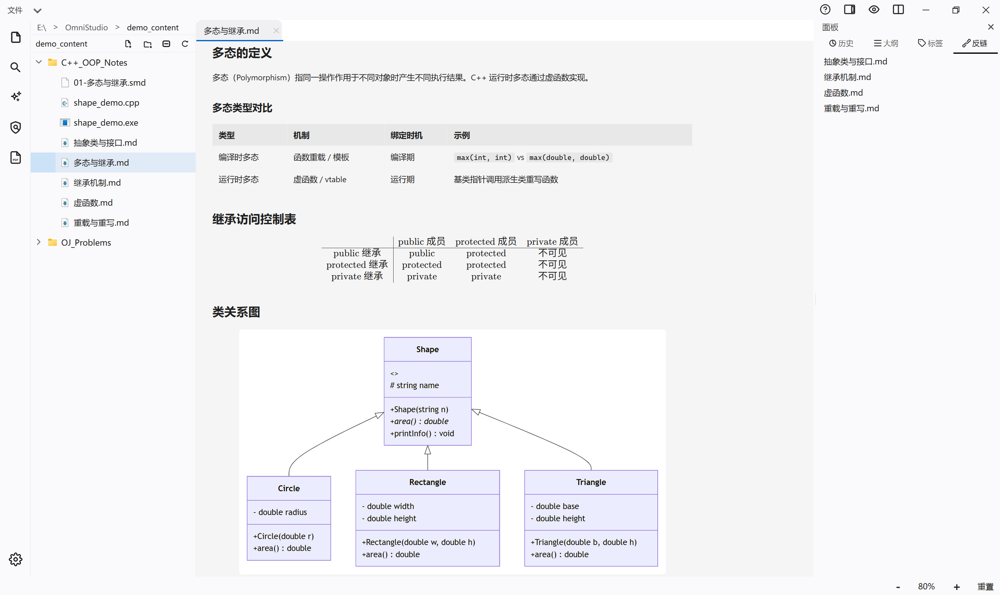
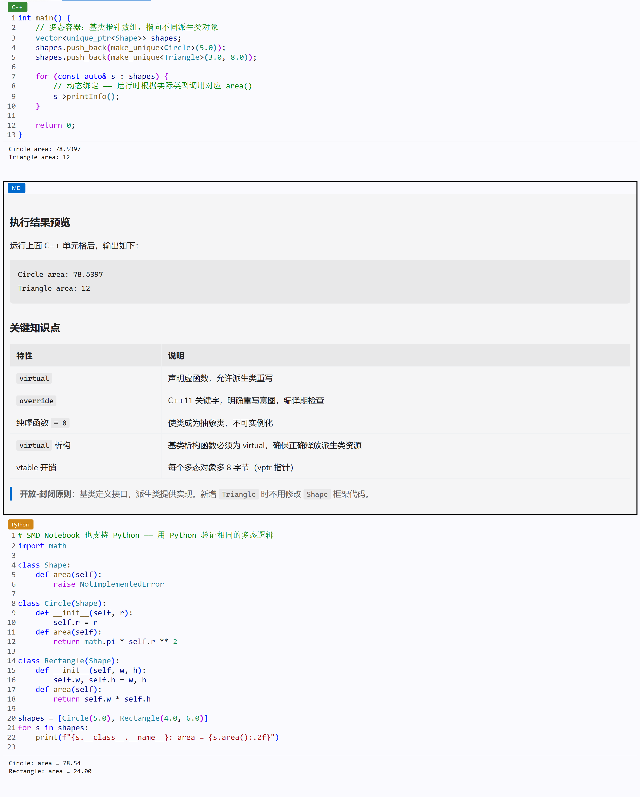
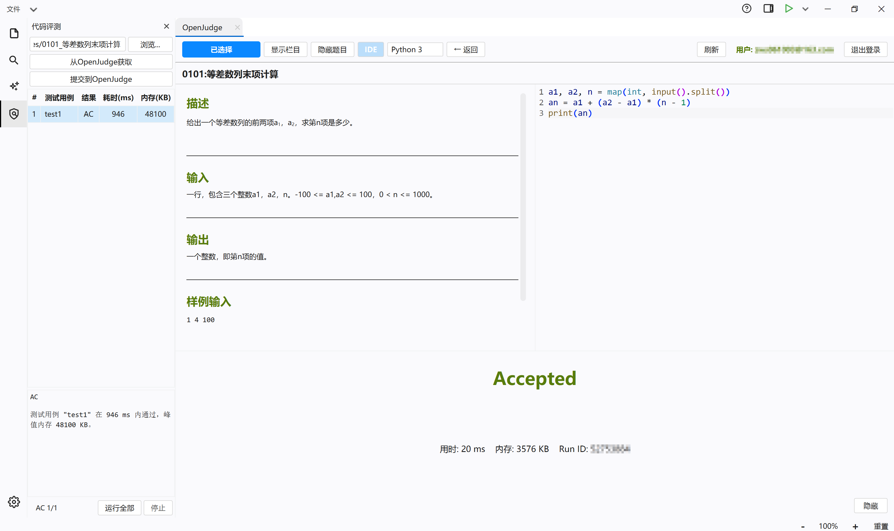
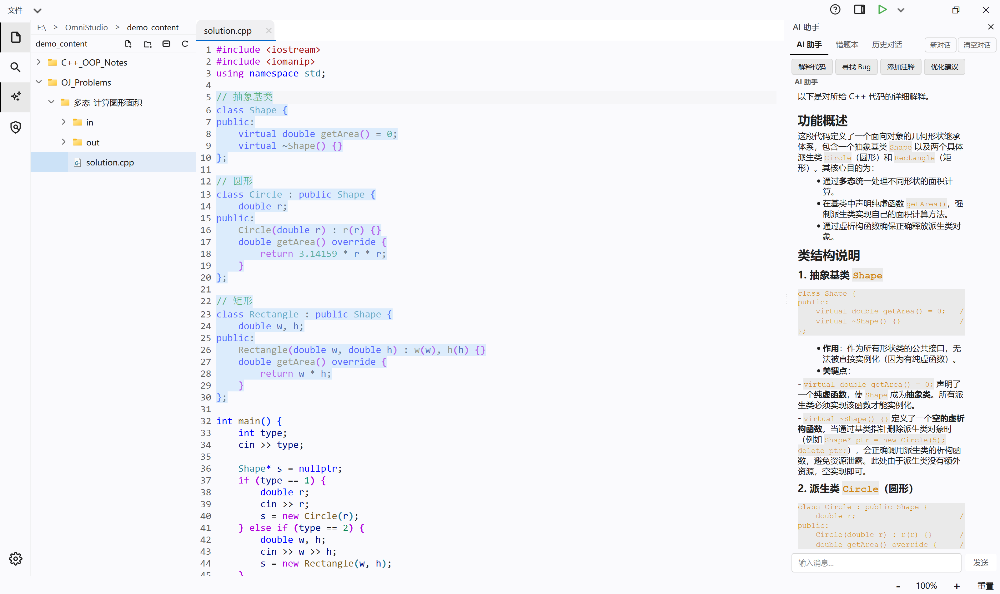
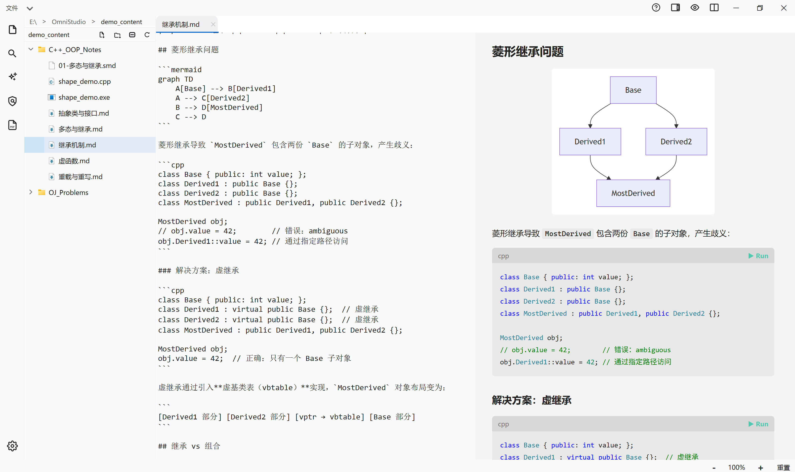

<div align="center">


# OmniStudio

[](https://github.com/s11phere/Omni-Studio)
[](https://github.com/s11phere/Omni-Studio)
[](https://github.com/s11phere/Omni-Studio)
[](https://www.qt.io)
[](https://en.cppreference.com/w/cpp/17)
[](LICENSE)

[](https://github.com/s11phere/Omni-Studio/actions/workflows/linux-build.yml)
[](https://github.com/s11phere/Omni-Studio/actions/workflows/macos-build.yml)
[](https://github.com/s11phere/Omni-Studio/actions/workflows/windows-build.yml)

</div>

**OmniStudio** 是一款整合 Markdown 笔记、代码编辑、AI 辅助与在线评测的桌面工具，让学习与编程工作流在同一个窗口中完成。

尤其适合北京大学信科课程的学习场景——学习《程序设计实习》等课程时，你不再需要在笔记软件、IDE、OJ 网页和 AI 聊天窗口之间反复切换。OmniStudio 把这些能力全部整合在一起：它是笔记软件，是代码编辑器，是 OJ 客户端，也是 AI 助教。



## 功能

### SMD 笔记本

受 Jupyter Notebook 启发的单元格编辑器。一个 `.smd` 文件包含 Markdown、C++、Python 三种单元格类型，支持混合编排。

- 用 Markdown 单元格写题解思路，C++ 单元格写代码，点击执行即可编译运行
- C++ 单元格按 `main()` 函数自动分组编译，Python 单元格通过持久化进程保留跨单元格命名空间
- 支持与 `.md` 格式双向无损转换



### OpenJudge 集成

北京大学《程序设计实习》等课程使用的在线评测平台，直接嵌入桌面：

- 题目浏览、登录凭据管理、代码提交
- 自动获取评测结果，错误用例 AI 辅助分析
- 支持本地错题记录与复盘



### AI 助手

侧边栏对话式 AI，实时互动：

- 多轮对话，流式输出
- 上下文感知：可基于当前编辑器内容提问
- 错题本：自动保存失败用例，可一键发送给 AI 分析
- 与本地评测引擎联动，分析运行时错误与逻辑错误



### 编辑器系统

- **多模式编辑器**：支持 Markdown 源码编辑、实时渲染预览、分屏编辑预览、代码编辑、PDF 阅读及 SMD 单元格编辑六种模式。
- **语法高亮引擎**：为 C/C++ 与 Python 提供关键字、类型、字符串、注释等分色彩色高亮。
- **数学公式渲染**：集成 KaTeX，支持行内与块级 LaTeX 公式渲染。
- **Mermaid 图表**：支持在 Markdown 中嵌入流程图、时序图、类图、甘特图等常用图表。
- **多文档界面 (MDI)**：标签页式文档管理，支持等宽与非等宽两种标签布局模式。



### 代码辅助

- **LSP 代码补全**：C++ 通过 clangd、Python 通过 Jedi 实现语言服务器协议补全，并提供关键字补全作为降级方案。
- **悬停提示**：光标悬停时显示类型签名、文档与定义位置等上下文信息。
- **诊断波浪线**：编译器与 LSP 产生的错误与警告以彩色波浪下划线标注于编辑器中，并汇总至底部诊断面板。

### 知识管理

- **双向链接**：支持 `[[文件名]]` 语法，在笔记间建立可跳转的引用关系。
- **反向链接面板**：展示当前文档被其他文件引用的来源列表。
- **标签系统**：支持 `#tag` 语法，提供标签索引与关联文件导航。
- **全文搜索**：在当前工作目录的所有文本文件中检索关键词，结果高亮并支持跳转。
- **大纲导航**：自动解析文档标题层级结构，点击标题跳转至对应位置。

### 编译、运行与评测

- **编译运行**：C/C++ 代码经编译后执行，Python 代码直接运行，输出显示于底部终端面板。
- **本地评测**：选取测试用例批量运行，输出 OJ 风格的逐行对比结果。
- **错题记录**：自动记录失败用例的输入、输出与期望结果，支持 AI 辅助分析。

### 用户界面与交互

- **无边框窗口**：自定义标题栏，支持拖拽移动与窗口缩放。
- **文件树**：提供面包屑导航、文件内联新建/重命名/删除及拖拽移动操作。
- **主题系统**：深色与浅色双主题，支持运行时即时切换。
- **设置面板**：悬浮遮罩式分类设置界面，涵盖编辑器、AI 服务、快捷键等配置项。

## 技术栈

| 层 | 选型 |
|---|---|
| 界面框架 | Qt 6.11 (QWidget) |
| 构建系统 | CMake 3.22+ / qmake |
| 代码补全 | LSP (clangd / Jedi) |
| 公式渲染 | KaTeX |
| 图表渲染 | Mermaid |
| AI 接口 | OpenAI / Anthropic 兼容 API |

## 配置

程序首次启动会在可执行文件所在目录生成 `config.json`（内建默认值）。常用配置项：

- **AI 服务**：启动后打开设置面板（`Ctrl+,`），在"AI 服务"页配置 API Endpoint、Model 与 API Key。Key 混淆存储，不出现在明文配置中。
- **编译器与解释器路径**：如需指定 clangd 或 Python 的特定路径，在设置面板"工具"页中填写，留空则使用系统 PATH。

其余设置（编辑器字体/字号、缩进、快捷键、外观配色等）均在设置面板中提供可视化配置，无需手动编辑配置文件。

## 构建与运行

### 系统要求

| 平台 | 编译器 | 构建工具 | Qt 6 |
|------|--------|----------|------|
| **Linux** | GCC 12+ / Clang 16+ | CMake 3.22+ + Make | [`qt6-base-dev`, `qt6-webengine-dev`, `qt6-pdf-dev`, `qt6-svg-dev`](https://doc.qt.io/qt-6/linux.html) |
| **macOS** | Apple Clang (Xcode 15+) | CMake 3.22+ + Make | `brew install qt`（keg-only，需配置 `CMAKE_PREFIX_PATH`） |
| **Windows** | MSVC 2022 (VS 2022) | CMake 3.22+ + Ninja | [在线安装](https://www.qt.io/download-qt-installer) 或 `aqtinstall` |

> 所有平台均需 **CMake 3.22+** 和 **C++17 编译器**。Qt 版本要求 **6.10+**。

### 依赖安装

<details>
<summary><b>Linux (Ubuntu/Debian)</b></summary>

```bash
sudo apt-get update
sudo apt-get install -y qt6-base-dev qt6-webengine-dev qt6-pdf-dev qt6-svg-dev \
    cmake g++

# 可选：Wayland 支持
sudo apt-get install -y qt6-wayland
```
</details>

<details>
<summary><b>macOS</b></summary>

```bash
# 安装 Xcode Command Line Tools
xcode-select --install

# 安装 Qt 6（keg-only，安装后需记录路径）
brew install qt

# CMake 可通过 Homebrew 或从 https://cmake.org/download/ 安装
brew install cmake
```

> Homebrew 将 Qt 安装为 keg-only 包，配置 CMake 时需指定路径：
> ```bash
> # 在 cmake 配置命令前添加
> export CMAKE_PREFIX_PATH="$(brew --prefix qt)"
> ```
</details>

<details>
<summary><b>Windows</b></summary>

**方式一：Qt 在线安装器（推荐）**
1. 从 [qt.io/download-qt-installer](https://www.qt.io/download-qt-installer) 下载安装器
2. 安装时勾选 **Qt 6.10+ → MSVC 2022 64-bit**，以及 `Qt WebEngine`、`Qt PDF`、`Qt SVG` 模块
3. 安装 [Visual Studio 2022](https://visualstudio.microsoft.com/)（选择"使用 C++ 的桌面开发"工作负载）
4. 安装 [Ninja](https://github.com/ninja-build/ninja/releases) 并加入 `PATH`

**方式二：aqtinstall（CI/自动化）**

```bash
pip install aqtinstall
aqt install-qt windows desktop 6.10.3 win64_msvc2022_64 -m qtwebengine qtpdf qtsvg
```
</details>

### CMake 构建（跨平台，推荐）

项目使用 CMake Presets 管理不同平台和构建类型。产物输出到 `./release/`。

| 平台 | 构建类型 | Configure 命令 |
|------|----------|---------------|
| **Linux** | Release | `cmake --preset linux-release` |
| | Debug | `cmake --preset linux-debug` |
| **macOS** | Release | `cmake --preset macos-release` |
| | Debug | `cmake --preset macos-debug` |
| **Windows** (VS 2022 + Ninja) | Release | `cmake --preset win32-release` |
| | Debug | `cmake --preset win32-debug` |

**Release 构建示例：**

```bash
# 配置
cmake --preset linux-release            # Linux
CMAKE_PREFIX_PATH="$(brew --prefix qt)" cmake --preset macos-release   # macOS

# Windows（需在 VS 2022 x64 Native Tools Command Prompt 中执行）
cmake --preset win32-release

# 构建
cmake --build build/release -j$(nproc)                    # Linux / macOS
cmake --build build/release -j $env:NUMBER_OF_PROCESSORS  # Windows
```

**Debug 构建**将 `*-release` 替换为对应的 `*-debug` 预设即可。

> **注意**：修改 `.qrc` 资源文件后需重新执行 configure 步骤。

### 便捷脚本（macOS / Linux）

`build.sh` 自动检测平台并选择合适的 CMake Preset：

```bash
./build.sh              # Release 构建（默认）
./build.sh debug        # Debug 构建
./build.sh clean        # 删除 build 目录
./build.sh rebuild      # 清理后重新构建
```

### qmake 构建（仅 Windows）

在 **VS 2022 x64 Native Tools Command Prompt** 中执行：

```bash
qmake.exe -r omnistudio.pro
jom.exe -f Makefile.Release -j22   # 或 nmake 作为备选
```

### 运行

构建产物路径：

| 平台 | 可执行文件 |
|------|-----------|
| **Linux** | `build/release/OmniStudio` |
| **macOS** | `build/release/OmniStudio.app` |
| **Windows** | `build/release/OmniStudio.exe` |

macOS 上首次运行前需进行 ad-hoc 签名（QtWebEngine 要求）：

```bash
codesign --force --deep --sign - build/release/OmniStudio.app
open build/release/OmniStudio.app
```

其他平台双击可执行文件或在终端中直接运行。

> **提示**：AI 功能依赖 OpenAI / Anthropic 兼容 API。启动后进入设置面板配置 API Endpoint 与 Key。

## 贡献

欢迎 ⭐ Star、🐛 Issue 与 🔀 PR。

## 许可证

[GPLv3](LICENSE)
